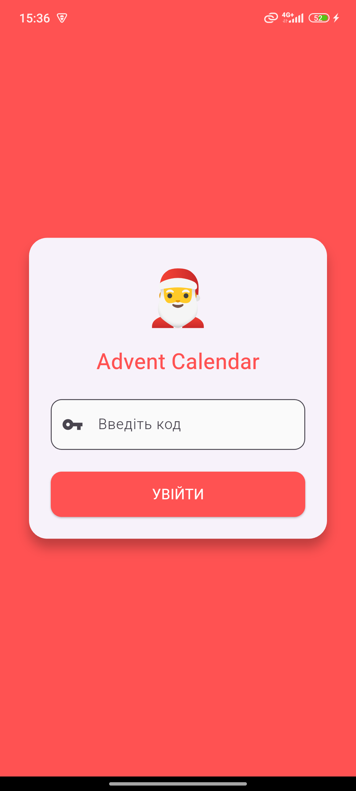
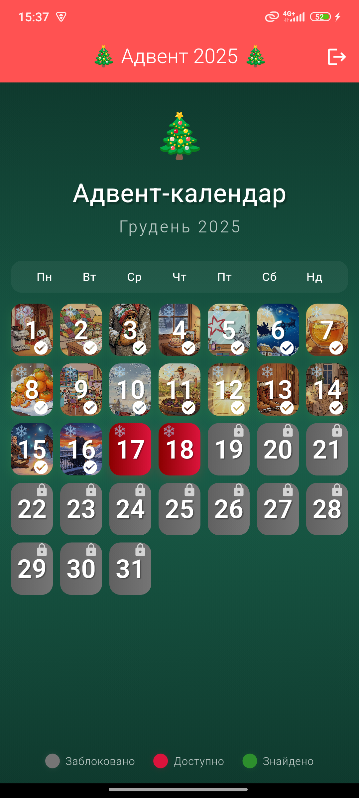
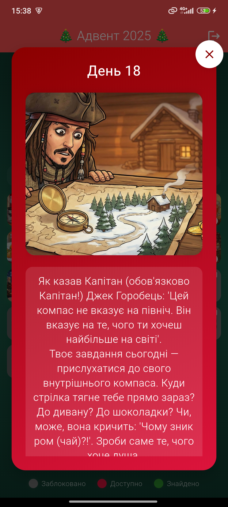
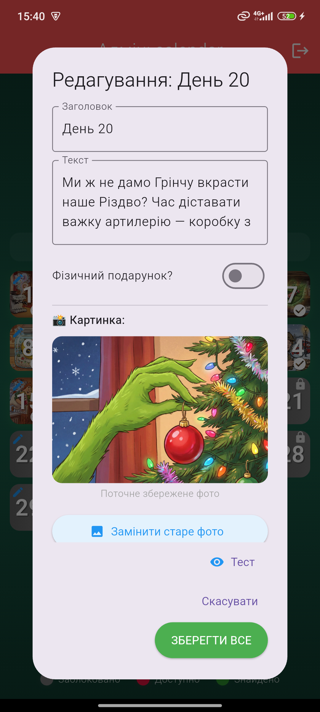

# Interactive Advent Calendar App

A fully functional mobile Advent Calendar application built with **Flutter** and **Firebase**.
This project was designed to create an engaging holiday experience with real-time cloud synchronization, multimedia content support, and a built-in content management system (CMS).

## Screenshots

| Login & Auth | Main Calendar | Gift Reveal | Admin Panel |
|:---:|:---:|:---:|:---:|
|  |  |  |  |
## Key Features

### For Users
* **Spoiler Protection:** Logic prevents opening future dates based on server time (`DateTime.now()` checks).
* **Multimedia Experience:** Supports playing background music (`audioplayers`) and displaying high-quality images (`cached_network_image`).
* **Interactive UI:** Animations, confetti effects, and custom dialogs for a festive atmosphere.
* **State Persistence:** Progress (found gifts) is saved in Cloud Firestore, allowing login from multiple devices.

### For Admins (CMS)
* **In-App Editing:** Modify titles, descriptions, and "Gift/No Gift" status directly from the UI.
* **Media Upload:** Upload photos and audio files directly to **Firebase Storage** via the app.
* **Template System:** Automated propagation of changes from a "Master Calendar" to all user calendars using Cloud Functions logic implemented in the service layer.

## Technical Stack

* **Architecture:** MVVM (Model-View-ViewModel).
* **State Management:** Provider (`ChangeNotifier`, `MultiProvider`).
* **Backend:** Firebase Firestore (NoSQL Database).
* **Storage:** Firebase Storage (Media hosting).
* **UI/UX:** Custom animations (`confetti`), Adaptive layouts, Material Design 3.

## Getting Started

1.  **Clone the repository:**
    ```bash
    git clone [https://github.com/your-username/advent-calendar.git](https://github.com/your-username/advent-calendar.git)
    ```
2.  **Install dependencies:**
    ```bash
    flutter pub get
    ```
3.  **Firebase Setup:**
    * Add your `google-services.json` (Android) or `GoogleService-Info.plist` (iOS) to the respective folders.
4.  **Run the app:**
    ```bash
    flutter run
    ```

## Author

**Junior Software Engineer**
*Master's in Software Engineering graduate (2025)*
Focusing on Mobile Development (Flutter/Native).
